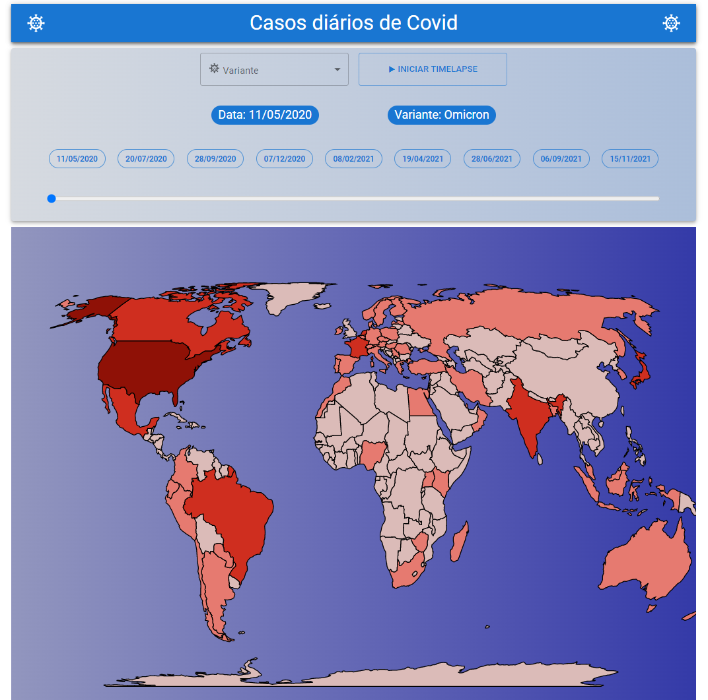

# Coodesh Frontend Challenge 🏅 2022 - Covid Daily Cases

Site: https://coodesh.com/

## Desafio proposto

Nesse desafio era necessário desenvolver em 5 dias uma REST API que utilizaria o histórico de casos de Covid, disponível em https://www.kaggle.com/datasets/yamqwe/omicron-covid19-variant-daily-cases.
No desafio também foi proposto desenvolver um projeto front-end para consumir as informações uma API gerada.
O projeto a ser desenvolvido tem como objetivo exibir o número de casos por país, dia e variante. Para isso será necessário gerar um gráfico que mostre o mapa mundi.

### Frameworks e tecnologias usadas:
- HTML, CSS E JAVASCRIPT
- React JS
- Material UI
- Supabase (servidor online)

### Veja o projeto funcionando em:

https://coodesh-frontend-covid-daily-cases-samuelcezar.vercel.app/

### Imagem do layout final do projeto:

### Como configurar e utilizar o projeto em 3 passos:

##### 1- Clonar o repositório.

##### 2 - Instalar as dependencias usando NPM ou Yarn:

- npm install

#### 3- Iniciar o projeto!
  - npm start

####OBS* Projeto não foi construido responsivamente, por isso para visualização ideal é necessário acessar via desktop.

